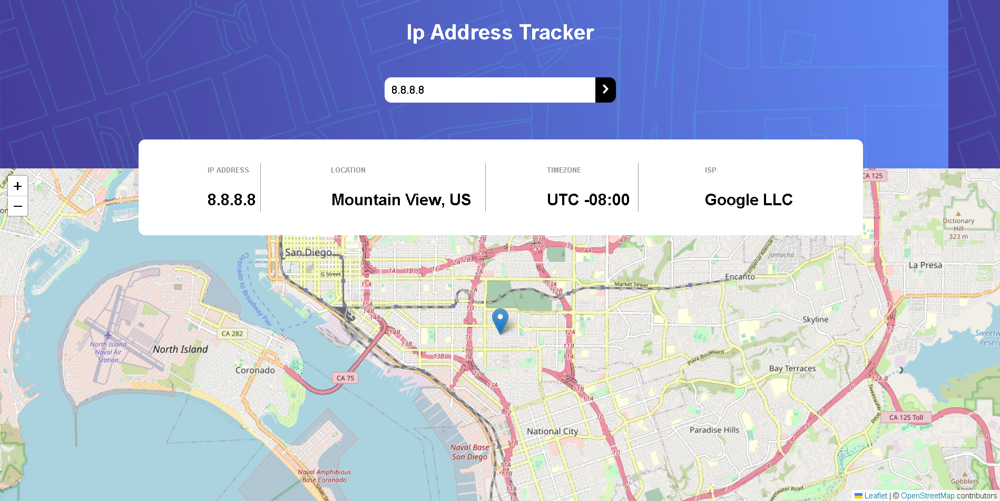

# Frontend Mentor - IP address tracker solution

This is a solution to the [IP address tracker challenge on Frontend Mentor](https://www.frontendmentor.io/challenges/ip-address-tracker-I8-0yYAH0). Frontend Mentor challenges help you improve your coding skills by building realistic projects. 

## Table of contents

- [Overview](#overview)
  - [The challenge](#the-challenge)
  - [Screenshot](#screenshot)
  - [Links](#links)
- [My process](#my-process)
  - [Built with](#built-with)
  - [What I learned](#what-i-learned)
  - [Continued development](#continued-development)
  - [Useful resources](#useful-resources)
- [Author](#author)

## Overview

### The challenge

Users should be able to:

- View the optimal layout for each page depending on their device's screen size
- See hover states for all interactive elements on the page
- See their own IP address on the map on the initial page load
- Search for any IP addresses or domains and see the key information and location

### Screenshot



### Links

- Solution URL: [Github](https://github.com/AbdelrahmanMahmoudDev/ip-tracker)

## My process

### Built with

- Semantic HTML5 markup
- CSS Modules
- Flexbox
- [React](https://reactjs.org/) - JS library
- [Next.js](https://nextjs.org/) - React framework

### What I learned

This project was a great execrise on managing multiple API endpoints. At some point, I had to utilize the context API
and as the data got bigger, the file would get pretty messy, So I created an array of values that I want in the context
and passed them as a prop:

```js
    const contextVal = {
        ipData,
        updateIp,
        updateClickState,
        updateIsValid,
        updateIsCustomInput
    }

    return (
        <IpContext.Provider value={contextVal}>
            {children}
        </IpContext.Provider>
    )
```

I also added functions to that array that can be used to update specific parts of the data:

```js
    const updateIp = (newIp: string) => {
        setIpData(prevData => ({
            ...prevData,
            ipAddress: newIp
        }))
    };

    const updateClickState = (newState: boolean) => {
        setIpData(prevData => ({
            ...prevData,
            isClicked: newState
        }))
    }

    const updateIsValid = (newBool: boolean) => {
        setIpData(prevData => ({
            ...prevData,
            isValid: newBool
        }))
    }

    const updateIsCustomInput = (newBool: boolean) => {
        setIpData(prevData => ({
            ...prevData,
            isCustomInput: newBool,
        }))
    }
```

### Continued development

**I would like to work harder on the mobile aspect. I failed to design the website mobile-first and with a lack of a grid
system set up, finishing the mobile design requires more work

**I would like to do a pass over the entire codebase and refactor it as much as possible

### Useful resources

- [Vercel SWR](https://swr.vercel.app/docs/with-nextjs) - This is a must because the app requires fetching data based on user input, so this has to be done on the client side, SWR provides a useful hook that manages the fetched data's lifetime
- [React Leaflet](https://react-leaflet.js.org/) - To display the map, I wanted to use Leaflet, these are bindings for Leaflet on React

## Author

- Website - [Abdelrahman Mahmud](https://www.linkedin.com/in/abdelrahman-mahmoud-535831197/)
- Frontend Mentor - [@AbdelRahmanMahmoudDev](https://www.frontendmentor.io/profile/AbdelRahmanMahmoudDev)
- Twitter - [@abdlrhmnmhmud](https://twitter.com/abdlrhmnmhmud)